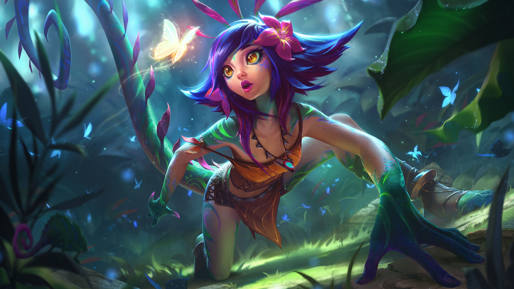
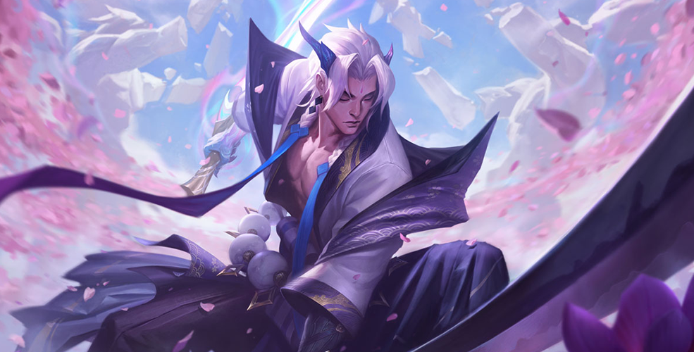

# Python爬虫爬取英雄联盟全皮肤

注意：可能会被识别为爬虫进而远程关闭连接，要自己加一些反反爬策略。

一个简单粗暴的法子：利用第一次获取的name_list，每次停到那里就删到哪里，分块完成。

# 本质鸡杂

我摊牌，我就是元年粉，我就是纯鸡杂！IG牛逼！

# KDA女团

真有女团内味儿，哈哈，第一版确实挺好看的（除了阿狸），第二版一言难尽（寡妇太大妈，卡莎太壮）……

阿卡丽好英气啊，但又不乏女性美，非至臻皮肤稍微暗了些，这个更好看，还当过我Github头像。 

卡莎非至臻皮肤那个头发还是稍微不习惯一些，这个至臻的画真的好好看啊。 

不太喜欢寡妇非至臻那个皮肤，总觉得发型不合我胃口，顺便一说，阿狸画的真难看。 

KDA第二次出场，寡妇和卡莎我看不下去了，也就阿卡丽和阿狸还能说得过去。 

# 皮肤墙

这些都是我很喜欢的一些皮肤，无他，画好看！

这是个人看着最好看的乐芙兰皮肤，Rookie的两球一姬皮肤英雄，观赏性极强的高爆发刺客法师。 

吸血鬼是一个很Cool的英雄，也是Shy哥打出过无数精彩操作的英雄，其实仔细看看挺帅的，选来选去还是用原皮吧。 

稻草人挺有意思的，这个图画的就很搞笑，哈哈。 

天使是Shy哥下凡英雄之一，有着诸多名场面，好多图画的并不显得人好看，这图其实画的算是好看的了。 

轮子妈的这个图算是比较青春靓丽的，还可以。 

腥红之月卡莉斯塔，哈哈，Shy哥长手打短手逼的别人ban卡莉斯塔好久，好吧，但这是轮子妈。 

奶妈这英雄就很合我胃口，冬境仙灵这种风格的皮肤个人也很喜欢啦。 

真觉得和个神祇一样，很好看，哈哈。 

同上，图基本一样。 

把提莫化成熊猫，太好玩了，好可爱呀。 

灵魂莲华这套皮肤画的是真的好看，很喜欢。 

女枪确实好看，嗯，确实。 

挺好看的，嗯。 

雍容华贵的感觉，很不错，嗯。 

挺好看的，嗯。 

挺好看的，嗯。 

很喜欢万圣节风格的东西，更何况是女枪。 

很喜欢万圣节风格的东西，更何况是女枪。 

冠军之箭，如其名，希望LPL能勇夺冠军。 

特别喜欢这种风格，寒冰好帅啊。 

很喜欢龙的风格，很高贵，虽然人脸淡化了很多。 

个人觉得画莫甘娜画的最好看的一张，那些皮肤图里莫甘娜画的也太丑了啊。 

魅惑女巫这个风格确实挺好看的。 

好霸气，莫甘娜这个图真的很帅啊。 

暗黑风格的寡妇，有自己的美感。 

很喜欢假面风格，哈哈，背后利刃瞩目，小心玫瑰扎手啊小伙儿。 

为啥我总觉得这俩挺配，哈哈哈。 

喜欢南瓜风格，阿木木也特别可爱，它的皮肤我很喜欢的，选了这个作为代表。 

冰和凤凰都是我很喜欢的元素，卧槽，冰！哈哈哈。 

琴女大多数皮肤我都不太喜欢，这个风格的皮肤讲道理我也不喜欢，但确实看着还说的过去。 

琴女的这个皮肤很圣洁的感觉，看起来很舒服。 

挺喜欢古堡风格、吸血鬼伯爵、黑蝙蝠元素的，想到了德古拉伯爵，正好挺想留卡萨丁的皮肤画，毕竟是世界赛的冒泡赛阻击ig两次的英雄，其实吸血鬼的这个皮肤也挺有内味的。 

刀妹是Shy哥当年秀的飞起的英雄，好看的皮肤也挺多的，这个就不错。 

冰雪风格的刀妹，挺好看的。 

莲花也是很好的主题元素啊，配上刀妹就很好看，刀锋在图中也柔和了起来。 

很英气的刀妹啊，也很好看。 

星之守护者做的还行，风女看着还挺顺眼的。 

魅惑女巫系列画的真的好看，也是我很喜欢的风格，风女自然不例外。 

黑是黑了点，不过确实有种出众的气质，毕竟天启者，又想到了七万块中单的露露卡尔玛，哈哈。 

有内味儿了，卡尔玛有种悟道的感觉。 

这个风格真的很英气，红色配上卡尔玛也很好的嘛。 

小法画的也挺可爱的，虽然它的控制真的很恶心。 

个人觉得女警的这个图画的很好，这装束，我想到了SNSD。 

卡特的这个皮肤是我喜欢的风格。 

皇子一往无前的开团确实很酷，原皮有那味道。 

雍容华贵的气息，金色的蜘蛛女皇也挺帅的。 

蜘蛛的魅惑女巫风格也挺好看的。 

火男炼铁，哈哈，不过这图是真的霸气，像个行走于人间的神祇。 

宁人用盲僧创造过许多奇迹，也拉垮到科目二宁王竞速，这也是天的皮肤英雄，神龙尊者很帅。 

薇恩的灵魂莲华我觉得一般，但这个确实挺好看，甚至比至臻略好看一点，可惜那个小胖子没用薇恩赢下冠军。 

我用此图做了很久的壁纸，确实挺好看的，魔蛇变成了美女蛇。 

哈哈，大头这图笑死我。 

真有点埃及艳后的感觉，伊丽莎白•泰勒演的埃及艳后给我留下了很深的印象。 

我不太喜欢豹女的画风，但这个图的画风确实合我胃口。 

潘森的原皮真有一种战神的感觉，帅帅帅。 

伊泽瑞尔不愧是设计师亲儿子。 

阿卡丽挺英气的，但也不乏美感，这图挺不错的。 

Shy哥曾用凯南打出过天雷降世的名场面，也曾被抓到1-10，牛宝的皮肤恰好是凯南，这图画的挺对味的。 

盖伦的神王皮肤真的很霸气。 

果真还是金色的光比较适合日女。 

日女这皮肤摆脱了传统的拘束，我个人也比较喜欢战斗学院的风格。 

少侠你好帅啊。 

瑞雯是Shy哥成名英雄，皮肤的图其实看着并不顺眼，灵魂莲华是最好的了。 

哈哈吗，大嘴好可爱。 

这个风格的拉克丝很好看啊。 

确实是神女风格，挺好的。 

战斗学院至臻会更好一些，这风格，为啥总觉得和EZ好配。 

暗星女王比起耀星女神，好就好在了嘴角那一抹邪魅的笑容。 

阿狸的好多皮肤感觉画的不好看，这图还可以，有种慵懒的感觉。 

阿狸的灵魂莲华也当过壁纸，就是感觉腿有点粗。 

韦鲁斯确实俊美。 

这猪^(*￣(oo)￣)^，挺喜感，厂长养的好啊。 

德莱文长得丑话还多，但这个图结合破败之王那个背景，觉得还可以，JackeyLove的1557我无法忘记。 

杰斯是进攻能力很强的上单英雄，中期伤害很恐怖，也是Shy哥招牌英雄之一。 

冰女皮肤也挺丑的，这个还挺霸气。 

这算是皎月比较霸气且好看的画了，比起至臻的金色，这种暗色调更适合皎月教派的背景。 

这算是辛德拉看着比较顺眼的皮肤了，暗黑元首却有着神圣的气息，芜湖，两球一姬。 

这算是婕拉比较好看的皮肤了，暗色调更契合魔女身份。 

大歌星确实长得好看，有那种万人迷的感觉。 

有一说一，快乐风男变身大叔挺帅的。 

精准与否，就是屠宰与手术的区别。 

塔姆是真的能吃，奥利给干就完了。 

这个男人，背景故事里强的离谱，还长得贼帅，离谱。 

本来是觉得卢仙长得不行，但确实卢仙是Shy哥极度痴迷的英雄，用这英雄他送输了无数比赛，但他确实玩的流畅无比，哎，希望他多玩点阳间英雄。 

我永远忘不了那个天神下凡一打四的剑魔，Shy哥的剑魔，一往无前。 

有一种花前月下世外桃源的感觉，挺美的画面。 

我总觉得黄鸡真的很霸气，确实有帝王之气。 

真有一种沙皇御统千军，称霸恕瑞玛的感觉。 

猫咪真的是太可爱了吧。 

战斗什么？校长，哈哈。 

萨弥拉这图真的很帅气啊。 

霞洛真的好配啊。 

太甜了，我饱了。 

祝二位早生贵子，远离牛头。 

塞拉斯也挺帅的啊。 

我还记得Rookie用妮蔻赢下的比赛，好像还有Shy哥的上单妮蔻，哈哈，妮蔻确实挺好看的。 

至臻确实好看，但非至臻也不赖。 

这个至臻皮肤确实挺好看。 

月男，你帅的离谱。 

永恩的灵魂莲华也是挺俊美的呀。 

劲夫劲夫，你霸气侧漏的样子真的很靓仔呀。 

让我们欢迎叫声迷人的S10世界赛毒瘤鹿仙。 

